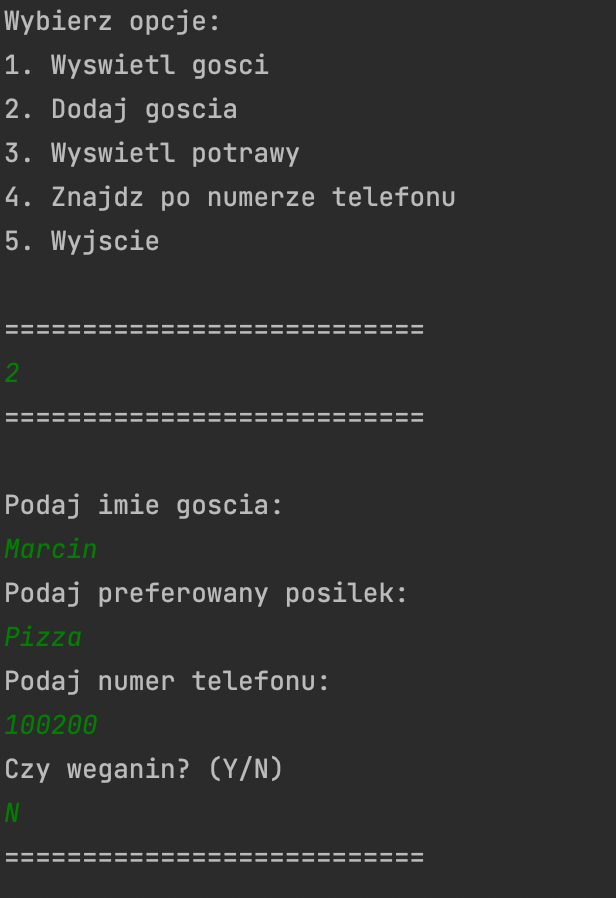

# Java-Party
List of guests for a party using Java and OOP

## Table of contents

- [Overview](#overview)
  - [The challenge](#the-challenge)
  - [Screenshot](#screenshot)
- [My process](#my-process)
  - [Built with](#built-with)
  - [What I learned](#what-i-learned)
- [Author](#author)

## Overview

### The challenge

Users should be able to:

- Create their own guests list 
- Find guest by phone number
- Create a list of meals

### Screenshot

## My process
  
### Built with

- Java with help of IntelliJ and OOP

### What I learned
By building this project i practiced my OOP skills.

## Author

- Facebook - [Maks Slabysz](https://www.facebook.com/profile.php?id=100003793525580)

## Acknowledgments

This project was built with help of YouTube channel "Jak nauczyc sie programowania".
